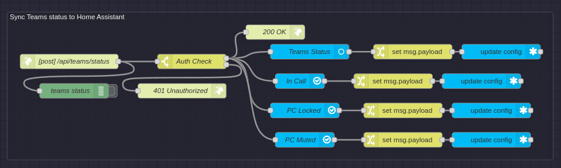

# Teams Status Monitor Node-RED flow

Using this flow you can have the PowerShell script send data to Node-RED which then relays it to Home Assistant. This also shows how easy it is to receive this data in Node-RED so you can also build a flow that doesn't use Home Assistant at all.

## Requirements

- Node-RED installed with module `node-red-contrib-home-assistant-websocket`
- Home Assistant installed

## Installing

1. Open [flow.json](flow.json), copy the contents, and paste into the import menu in Node-RED. 
2. Go over the nodes and configure them how you would like (if you haven't configured Node-RED to connect to your Home Assistant instance now is the time to do so)
3. Go to the `settings.ps1` file and update it to point to your Node-RED instance.
4. Restart the TeamsStatusMonitorService via Task Manager to apply the new changes.

You will now have your teams status syncing live over to Home Assistant.